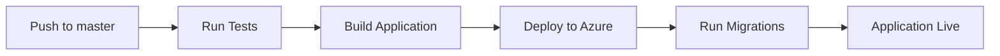

# CI/CD Pipeline - Setup Guide

Este proyecto incluye pipelines de CI/CD automatizados para despliegue en Azure App Service usando GitHub Actions.

## 📋 Contenido

- **Workflow de Despliegue**: `.github/workflows/azure-deploy.yml`
- **Workflow de Infraestructura**: `.github/workflows/infrastructure.yml`
- **Script de Inicio**: `startup.sh`
- **Configuración de Despliegue**: `.deployment`

## 🔧 Configuración Inicial

### 1. Secrets de GitHub

Configura los siguientes secrets en tu repositorio (Settings → Secrets and variables → Actions):

#### Para el Despliegue de la Aplicación:

```
AZURE_WEBAPP_PUBLISH_PROFILE
```

**Cómo obtenerlo:**
```bash
az webapp deployment list-publishing-profiles \
  --name app-dev-taskmanager-northeurope \
  --resource-group dev-taskmanager-rg \
  --xml
```

Copia todo el XML y agrégalo como secret.

#### Para el Despliegue de Infraestructura (opcional):

```
AZURE_CLIENT_ID
AZURE_CLIENT_SECRET
AZURE_SUBSCRIPTION_ID
AZURE_TENANT_ID
```

**Cómo obtenerlos:**
```bash
# Crear Service Principal
az ad sp create-for-rbac \
  --name "taskmanager-github-actions" \
  --role contributor \
  --scopes /subscriptions/{SUBSCRIPTION_ID} \
  --sdk-auth

# Te devolverá un JSON con:
# - clientId → AZURE_CLIENT_ID
# - clientSecret → AZURE_CLIENT_SECRET
# - subscriptionId → AZURE_SUBSCRIPTION_ID
# - tenantId → AZURE_TENANT_ID
```

### 2. Variables de Entorno en Azure App Service

Configura estas variables en Azure App Service (Configuration → Application settings):

```bash
SECRET_KEY=your-django-secret-key-here
DEBUG=False
ALLOWED_HOSTS=app-dev-taskmanager-northeurope.azurewebsites.net

# Database
DB_HOST=psql-dev-taskmanager-northeu.postgres.database.azure.com
DB_NAME=taskmanager_db
DB_USER=taskadmin
DB_PASSWORD=your-db-password

# Azure Storage
AZURE_STORAGE_CONNECTION_STRING=your-connection-string

# Application Insights
APPINSIGHTS_INSTRUMENTATION_KEY=your-instrumentation-key
APPLICATIONINSIGHTS_CONNECTION_STRING=your-connection-string

# Admin
ADMIN_EMAIL=admin@taskmanager.com
ADMIN_PASSWORD=your-secure-password
```

**Comando para configurar todas las variables:**
```bash
az webapp config appsettings set \
  --name app-dev-taskmanager-northeurope \
  --resource-group dev-taskmanager-rg \
  --settings \
    SECRET_KEY="$(python -c 'from django.core.management.utils import get_random_secret_key; print(get_random_secret_key())')" \
    DEBUG="False" \
    ALLOWED_HOSTS="app-dev-taskmanager-northeurope.azurewebsites.net" \
    DB_HOST="psql-dev-taskmanager-northeu.postgres.database.azure.com" \
    DB_NAME="taskmanager_db" \
    DB_USER="taskadmin" \
    DB_PASSWORD="your-db-password" \
    AZURE_STORAGE_CONNECTION_STRING="your-connection-string" \
    APPINSIGHTS_INSTRUMENTATION_KEY="your-key" \
    ADMIN_EMAIL="admin@taskmanager.com" \
    ADMIN_PASSWORD="your-secure-password"
```

### 3. Configurar el Startup Command en Azure

```bash
az webapp config set \
  --name app-dev-taskmanager-northeurope \
  --resource-group dev-taskmanager-rg \
  --startup-file "startup.sh"
```

## 🚀 Workflows

### Pipeline de Despliegue de Aplicación (azure-deploy.yml)

**Trigger:** Push a la rama `master` o manual dispatch

**Pasos:**
1. **Test**: Ejecuta pytest con cobertura
2. **Build**: Instala dependencias y recolecta archivos estáticos
3. **Deploy**: Despliega a Azure App Service y ejecuta migraciones

**Para ejecutar manualmente:**
1. Ve a Actions → Deploy to Azure App Service
2. Click en "Run workflow"
3. Selecciona la rama `master`
4. Click "Run workflow"

### Pipeline de Infraestructura (infrastructure.yml)

**Trigger:** Manual dispatch únicamente

**Pasos:**
1. Inicializa Terraform
2. Valida la configuración
3. Ejecuta plan/apply/destroy según la opción seleccionada

**Para ejecutar:**
1. Ve a Actions → Deploy Infrastructure
2. Click en "Run workflow"
3. Selecciona:
   - Environment: `dev`, `staging`, o `prod`
   - Action: `plan`, `apply`, o `destroy`
4. Click "Run workflow"

## 📊 Proceso de Despliegue

### Despliegue Automático (Después de cada commit a master)



1. Desarrollador hace push a `master`
2. GitHub Actions ejecuta tests automáticamente
3. Si los tests pasan, construye la aplicación
4. Despliega a Azure App Service
5. Ejecuta migraciones de base de datos
6. Aplicación disponible en producción

### Despliegue Manual

```bash
# Opción 1: Desde GitHub Actions UI
# Ve a Actions → Deploy to Azure App Service → Run workflow

# Opción 2: Desde Azure CLI
az webapp deployment source sync \
  --name app-dev-taskmanager-northeurope \
  --resource-group dev-taskmanager-rg
```

## 🔍 Verificación Post-Despliegue

### 1. Verificar que la aplicación está corriendo

```bash
# Check health endpoint
curl https://app-dev-taskmanager-northeurope.azurewebsites.net/

# Check logs
az webapp log tail \
  --name app-dev-taskmanager-northeurope \
  --resource-group dev-taskmanager-rg
```

### 2. Verificar migraciones

```bash
az webapp ssh \
  --name app-dev-taskmanager-northeurope \
  --resource-group dev-taskmanager-rg

# Dentro del SSH
python manage.py showmigrations
```

### 3. Verificar logs de Application Insights

Ve a Azure Portal → Application Insights → Logs y ejecuta:

```kql
requests
| where timestamp > ago(1h)
| summarize count() by resultCode
| order by count_ desc
```

## 🛠️ Troubleshooting

### Error: "No module named 'psycopg2'"

**Solución:** Verifica que `psycopg2-binary` está en `requirements.txt`

### Error: "ALLOWED_HOSTS validation failed"

**Solución:** Agrega el hostname de Azure App Service a ALLOWED_HOSTS:
```bash
az webapp config appsettings set \
  --name app-dev-taskmanager-northeurope \
  --resource-group dev-taskmanager-rg \
  --settings ALLOWED_HOSTS="app-dev-taskmanager-northeurope.azurewebsites.net"
```

### Error: "Database connection timeout"

**Solución:** Verifica que el firewall de PostgreSQL permite conexiones desde Azure:
```bash
az postgres flexible-server firewall-rule create \
  --resource-group dev-taskmanager-rg \
  --name psql-dev-taskmanager-northeu \
  --rule-name AllowAzureServices \
  --start-ip-address 0.0.0.0 \
  --end-ip-address 0.0.0.0
```

### Error en la recolección de archivos estáticos

**Solución:** Verifica que STATIC_ROOT está configurado en settings:
```python
STATIC_ROOT = os.path.join(BASE_DIR, 'staticfiles')
```

## 📝 Mantenimiento

### Actualizar dependencias

```bash
# Actualizar requirements.txt
pip list --outdated
pip install --upgrade <package>
pip freeze > requirements.txt

# Commit y push
git add requirements.txt
git commit -m "chore: update dependencies"
git push origin master
```

### Rollback a versión anterior

```bash
# Listar deployments
az webapp deployment list \
  --name app-dev-taskmanager-northeurope \
  --resource-group dev-taskmanager-rg

# Hacer rollback
az webapp deployment slot swap \
  --name app-dev-taskmanager-northeurope \
  --resource-group dev-taskmanager-rg \
  --slot staging
```

## 🔒 Seguridad

### Mejores prácticas:

1. **Nunca commitees secrets** - Usa GitHub Secrets o Azure Key Vault
2. **Rota las credenciales regularmente** - Cada 90 días
3. **Usa conexiones seguras** - HTTPS only, TLS 1.2+
4. **Limita el acceso SSH** - Solo para debugging
5. **Monitorea los logs** - Application Insights alertas

### Configurar alertas:

```bash
az monitor metrics alert create \
  --name high-response-time \
  --resource-group dev-taskmanager-rg \
  --scopes $(az webapp show --name app-dev-taskmanager-northeurope --resource-group dev-taskmanager-rg --query id -o tsv) \
  --condition "avg requests/duration > 1000" \
  --description "Alert when response time exceeds 1 second"
```

## 📈 Monitoreo

### Métricas clave a monitorear:

- **Response time**: < 1 segundo
- **Error rate**: < 1%
- **Availability**: > 99.9%
- **Database connections**: < 80% de max_connections
- **Storage usage**: Blob storage growth

### Dashboard en Application Insights:

1. Ve a Application Insights en Azure Portal
2. Availability → Add standard test
3. Performance → Server requests
4. Failures → Top 3 failure codes

## 🎯 Siguientes Pasos

1. **Configurar staging environment**
   - Crear `staging.tfvars`
   - Actualizar workflow con stage deploy

2. **Configurar custom domain**
   ```bash
   az webapp config hostname add \
     --webapp-name app-dev-taskmanager-northeurope \
     --resource-group dev-taskmanager-rg \
     --hostname taskmanager.yourdomain.com
   ```

3. **Habilitar SSL/TLS**
   ```bash
   az webapp config ssl bind \
     --name app-dev-taskmanager-northeurope \
     --resource-group dev-taskmanager-rg \
     --certificate-thumbprint <thumbprint> \
     --ssl-type SNI
   ```

4. **Configurar CDN para archivos estáticos**
   - Usar Azure CDN para `/static/`
   - Mejorar performance global

## 📚 Referencias

- [Azure App Service documentation](https://docs.microsoft.com/en-us/azure/app-service/)
- [GitHub Actions documentation](https://docs.github.com/en/actions)
- [Django deployment checklist](https://docs.djangoproject.com/en/stable/howto/deployment/checklist/)
- [Terraform Azure Provider](https://registry.terraform.io/providers/hashicorp/azurerm/latest/docs)
