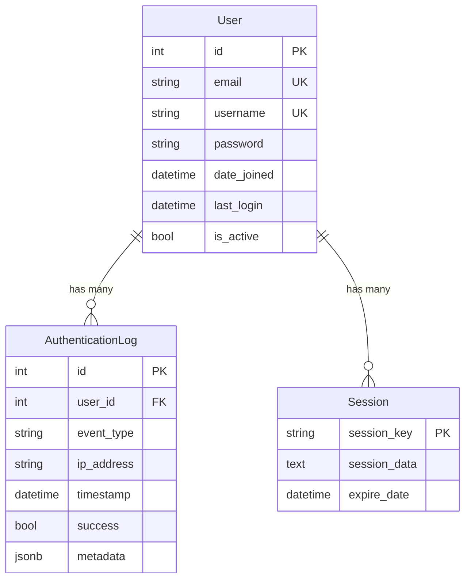

# Phase 1: Data Model - User Authentication System

**Date**: 2026-01-19  
**Feature**: 001-user-authentication  
**Branch**: `001-user-authentication`

## Overview

This document defines the database schema and data structures for the user authentication system. The data model supports user registration, authentication, profile management, and security audit logging.

---

## 1. User Model (Custom)

**Purpose**: Represents a registered user account with authentication credentials and profile information.

**Django Model**: `accounts.models.User` (extends `AbstractUser`)

**Schema**:
```python
from django.contrib.auth.models import AbstractUser
from django.db import models
from .managers import UserManager

class User(AbstractUser):
    # Override default fields
    email = models.EmailField(
        unique=True,
        db_index=True,
        help_text="User's email address (used for login)"
    )
    username = models.CharField(
        max_length=30,
        unique=True,
        db_index=True,
        help_text="Unique username (3-30 alphanumeric characters)"
    )
    first_name = models.CharField(max_length=150, blank=True)
    last_name = models.CharField(max_length=150, blank=True)
    
    # Timestamps (inherited from AbstractUser)
    date_joined = models.DateTimeField(auto_now_add=True)
    last_login = models.DateTimeField(null=True, blank=True)
    
    # Status flags (inherited from AbstractUser)
    is_active = models.BooleanField(default=True)
    is_staff = models.BooleanField(default=False)
    is_superuser = models.BooleanField(default=False)
    
    # Custom manager
    objects = UserManager()
    
    # Authentication configuration
    USERNAME_FIELD = 'email'  # Login with email
    REQUIRED_FIELDS = ['username']  # Required for createsuperuser
    
    class Meta:
        db_table = 'accounts_user'
        verbose_name = 'user'
        verbose_name_plural = 'users'
        ordering = ['-date_joined']
    
    def __str__(self):
        return self.email
```

**Database Columns** (PostgreSQL):
- `id` (INTEGER PRIMARY KEY, auto-increment)
- `email` (VARCHAR(254), UNIQUE, INDEX)
- `username` (VARCHAR(30), UNIQUE, INDEX)
- `password` (VARCHAR(128), bcrypt hash)
- `first_name` (VARCHAR(150), nullable)
- `last_name` (VARCHAR(150), nullable)
- `date_joined` (TIMESTAMP WITH TIME ZONE)
- `last_login` (TIMESTAMP WITH TIME ZONE, nullable)
- `is_active` (BOOLEAN, default TRUE)
- `is_staff` (BOOLEAN, default FALSE)
- `is_superuser` (BOOLEAN, default FALSE)

**Constraints**:
- `email` must be unique and valid email format
- `username` must be unique, 3-30 alphanumeric characters
- `password` must be bcrypt hashed (never plaintext)
- `email` normalized to lowercase before storage (handled by UserManager)

**Indexes**:
- Primary key on `id`
- Unique index on `email` (for login lookups)
- Unique index on `username` (for alternate login)

**Example**:
```python
user = User.objects.create_user(
    email='john.doe@example.com',
    username='johndoe',
    password='SecurePass123!',  # Will be hashed
    first_name='John',
    last_name='Doe'
)
```

---

## 2. UserManager (Custom Manager)

**Purpose**: Handles user creation with email normalization and password hashing.

**Django Manager**: `accounts.managers.UserManager` (extends `BaseUserManager`)

**Methods**:
```python
from django.contrib.auth.models import BaseUserManager

class UserManager(BaseUserManager):
    def normalize_email(self, email):
        """Normalize email to lowercase (override Django default)"""
        return email.lower() if email else email
    
    def create_user(self, email, username, password=None, **extra_fields):
        """Create and save a regular user"""
        if not email:
            raise ValueError('Email is required')
        if not username:
            raise ValueError('Username is required')
        
        email = self.normalize_email(email)
        user = self.model(email=email, username=username, **extra_fields)
        user.set_password(password)  # Hashes with bcrypt
        user.save(using=self._db)
        return user
    
    def create_superuser(self, email, username, password=None, **extra_fields):
        """Create and save a superuser"""
        extra_fields.setdefault('is_staff', True)
        extra_fields.setdefault('is_superuser', True)
        return self.create_user(email, username, password, **extra_fields)
```

**Rationale**: Ensures email normalization (handles edge case from spec) and consistent password hashing across all user creation paths.

---

## 3. AuthenticationLog Model

**Purpose**: Audit trail of authentication events for security monitoring and compliance.

**Django Model**: `accounts.models.AuthenticationLog`

**Schema**:
```python
from django.db import models
from django.conf import settings

class AuthenticationLog(models.Model):
    EVENT_TYPES = [
        ('registration', 'User Registration'),
        ('login', 'User Login'),
        ('logout', 'User Logout'),
        ('failed_login', 'Failed Login Attempt'),
        ('password_change', 'Password Change'),
    ]
    
    user = models.ForeignKey(
        settings.AUTH_USER_MODEL,
        on_delete=models.SET_NULL,
        null=True,
        blank=True,
        related_name='authentication_logs',
        help_text="User associated with event (null for failed login)"
    )
    event_type = models.CharField(
        max_length=20,
        choices=EVENT_TYPES,
        db_index=True
    )
    ip_address = models.GenericIPAddressField(
        help_text="IP address of the request"
    )
    user_agent = models.TextField(
        blank=True,
        help_text="Browser user agent string"
    )
    timestamp = models.DateTimeField(
        auto_now_add=True,
        db_index=True
    )
    success = models.BooleanField(
        default=True,
        help_text="Whether the event succeeded"
    )
    metadata = models.JSONField(
        default=dict,
        blank=True,
        help_text="Additional event context (e.g., failure reason)"
    )
    
    class Meta:
        db_table = 'accounts_authentication_log'
        verbose_name = 'authentication log'
        verbose_name_plural = 'authentication logs'
        ordering = ['-timestamp']
        indexes = [
            models.Index(fields=['-timestamp']),
            models.Index(fields=['event_type', '-timestamp']),
            models.Index(fields=['user', '-timestamp']),
        ]
    
    def __str__(self):
        return f"{self.event_type} - {self.user or 'Unknown'} - {self.timestamp}"
```

**Database Columns** (PostgreSQL):
- `id` (INTEGER PRIMARY KEY, auto-increment)
- `user_id` (INTEGER, FOREIGN KEY to accounts_user, nullable)
- `event_type` (VARCHAR(20), INDEX)
- `ip_address` (INET, PostgreSQL IP address type)
- `user_agent` (TEXT)
- `timestamp` (TIMESTAMP WITH TIME ZONE, INDEX)
- `success` (BOOLEAN, default TRUE)
- `metadata` (JSONB, PostgreSQL JSON type)

**Constraints**:
- `event_type` must be one of the defined choices
- `timestamp` auto-set on creation (cannot be modified)
- `user` can be NULL (for failed login attempts with non-existent email)

**Indexes**:
- Primary key on `id`
- Index on `timestamp` (DESC, for recent logs queries)
- Composite index on `event_type, timestamp` (for filtering by event type)
- Composite index on `user_id, timestamp` (for user's login history)

**Example**:
```python
AuthenticationLog.objects.create(
    user=user,
    event_type='login',
    ip_address='192.168.1.100',
    user_agent='Mozilla/5.0 ...',
    success=True
)
```

---

## 4. Django Session Model (Built-in)

**Purpose**: Store server-side session data for authenticated users.

**Django Model**: `django.contrib.sessions.models.Session`

**Schema** (managed by Django):
```python
class Session(models.Model):
    session_key = models.CharField(max_length=40, primary_key=True)
    session_data = models.TextField()  # Encrypted session data
    expire_date = models.DateTimeField(db_index=True)
    
    class Meta:
        db_table = 'django_session'
```

**Database Columns**:
- `session_key` (VARCHAR(40), PRIMARY KEY)
- `session_data` (TEXT, base64-encoded + encrypted)
- `expire_date` (TIMESTAMP WITH TIME ZONE, INDEX)

**Constraints**:
- `session_key` is unique, auto-generated
- `expire_date` indexed for cleanup queries
- Sessions older than `expire_date` are invalid

**Usage**:
```python
# Login creates session
request.session['_auth_user_id'] = str(user.pk)
request.session.save()

# Logout deletes session
request.session.flush()
```

**Rationale**: Django's session framework handles all complexity (CSRF tokens, session expiration, secure cookies). No custom code needed.

---

## Entity Relationships



**Cardinality**:
- One User has many AuthenticationLog entries (0..*)
- One User has many Sessions (0..*) - multiple devices/browsers
- AuthenticationLog.user can be NULL (failed login with non-existent email)

---

## Data Access Patterns

### 1. User Registration
```python
# Create user
user = User.objects.create_user(
    email='user@example.com',
    username='username',
    password='SecurePass123!'
)

# Log registration event (via signal)
AuthenticationLog.objects.create(
    user=user,
    event_type='registration',
    ip_address=request.META.get('REMOTE_ADDR'),
    user_agent=request.META.get('HTTP_USER_AGENT'),
    success=True
)
```

### 2. User Login
```python
# Authenticate user
from django.contrib.auth import authenticate, login

user = authenticate(request, email=email, password=password)
if user:
    login(request, user)  # Creates session
    # Log success (via signal)
else:
    # Log failed attempt
    AuthenticationLog.objects.create(
        user=None,
        event_type='failed_login',
        ip_address=request.META.get('REMOTE_ADDR'),
        success=False,
        metadata={'attempted_email': email}
    )
```

### 3. User Logout
```python
from django.contrib.auth import logout

logout(request)  # Deletes session
# Log logout (via signal)
```

### 4. Profile Update
```python
user.first_name = 'NewName'
user.email = 'newemail@example.com'
user.full_clean()  # Validates uniqueness, format
user.save()
```

### 5. Password Change
```python
if user.check_password(current_password):
    user.set_password(new_password)  # Hashes with bcrypt
    user.save()
    # Log password change (via signal)
```

### 6. Audit Log Queries
```python
# Recent login attempts for user
logs = AuthenticationLog.objects.filter(
    user=user,
    event_type='login'
).order_by('-timestamp')[:10]

# Failed login attempts (security monitoring)
failed = AuthenticationLog.objects.filter(
    event_type='failed_login',
    success=False,
    timestamp__gte=timezone.now() - timedelta(hours=24)
)
```

---

## Validation Rules

### User Model Validation
```python
# accounts/validators.py
import re
from django.core.exceptions import ValidationError

def validate_username(value):
    """Username: 3-30 alphanumeric characters"""
    if not re.match(r'^[a-zA-Z0-9]{3,30}$', value):
        raise ValidationError(
            'Username must be 3-30 alphanumeric characters',
            code='invalid_username'
        )

def validate_password_complexity(value):
    """Password: min 8 chars, 1 upper, 1 lower, 1 number, 1 special"""
    errors = []
    
    if len(value) < 8:
        errors.append('at least 8 characters')
    if not re.search(r'[A-Z]', value):
        errors.append('one uppercase letter')
    if not re.search(r'[a-z]', value):
        errors.append('one lowercase letter')
    if not re.search(r'\d', value):
        errors.append('one number')
    if not re.search(r'[!@#$%^&*(),.?":{}|<>]', value):
        errors.append('one special character')
    
    if errors:
        raise ValidationError(
            f"Password must contain {', '.join(errors)}",
            code='weak_password'
        )
```

### Form-Level Validation
```python
# accounts/forms.py
from django import forms
from .models import User
from .validators import validate_username, validate_password_complexity

class RegistrationForm(forms.ModelForm):
    password = forms.CharField(
        widget=forms.PasswordInput,
        validators=[validate_password_complexity]
    )
    password_confirm = forms.CharField(widget=forms.PasswordInput)
    
    class Meta:
        model = User
        fields = ['email', 'username', 'first_name', 'last_name', 'password']
    
    def clean_email(self):
        email = self.cleaned_data['email'].lower()
        if User.objects.filter(email=email).exists():
            raise forms.ValidationError('Email already registered')
        return email
    
    def clean_username(self):
        username = self.cleaned_data['username']
        validate_username(username)
        if User.objects.filter(username=username).exists():
            raise forms.ValidationError('Username already taken')
        return username
    
    def clean(self):
        cleaned_data = super().clean()
        password = cleaned_data.get('password')
        password_confirm = cleaned_data.get('password_confirm')
        if password and password_confirm and password != password_confirm:
            raise forms.ValidationError('Passwords do not match')
        return cleaned_data
```

---

## Migration Files

### Initial Migration: `0001_initial.py`

```python
# Generated by Django 5.0 on 2026-01-19

from django.conf import settings
from django.db import migrations, models
import django.db.models.deletion
import accounts.managers

class Migration(migrations.Migration):
    initial = True
    dependencies = [
        ('auth', '0012_alter_user_first_name_max_length'),
    ]
    
    operations = [
        migrations.CreateModel(
            name='User',
            fields=[
                ('id', models.BigAutoField(primary_key=True, serialize=False)),
                ('password', models.CharField(max_length=128)),
                ('last_login', models.DateTimeField(blank=True, null=True)),
                ('is_superuser', models.BooleanField(default=False)),
                ('email', models.EmailField(max_length=254, unique=True, db_index=True)),
                ('username', models.CharField(max_length=30, unique=True, db_index=True)),
                ('first_name', models.CharField(blank=True, max_length=150)),
                ('last_name', models.CharField(blank=True, max_length=150)),
                ('date_joined', models.DateTimeField(auto_now_add=True)),
                ('is_active', models.BooleanField(default=True)),
                ('is_staff', models.BooleanField(default=False)),
                ('groups', models.ManyToManyField(blank=True, to='auth.group')),
                ('user_permissions', models.ManyToManyField(blank=True, to='auth.permission')),
            ],
            options={
                'db_table': 'accounts_user',
                'verbose_name': 'user',
                'verbose_name_plural': 'users',
                'ordering': ['-date_joined'],
            },
            managers=[
                ('objects', accounts.managers.UserManager()),
            ],
        ),
        migrations.CreateModel(
            name='AuthenticationLog',
            fields=[
                ('id', models.BigAutoField(primary_key=True, serialize=False)),
                ('event_type', models.CharField(max_length=20, db_index=True, choices=[...])),
                ('ip_address', models.GenericIPAddressField()),
                ('user_agent', models.TextField(blank=True)),
                ('timestamp', models.DateTimeField(auto_now_add=True, db_index=True)),
                ('success', models.BooleanField(default=True)),
                ('metadata', models.JSONField(default=dict, blank=True)),
                ('user', models.ForeignKey(null=True, blank=True, on_delete=django.db.models.deletion.SET_NULL, to=settings.AUTH_USER_MODEL, related_name='authentication_logs')),
            ],
            options={
                'db_table': 'accounts_authentication_log',
                'verbose_name': 'authentication log',
                'verbose_name_plural': 'authentication logs',
                'ordering': ['-timestamp'],
            },
        ),
        migrations.AddIndex(
            model_name='authenticationlog',
            index=models.Index(fields=['-timestamp'], name='accounts_au_timesta_idx'),
        ),
        migrations.AddIndex(
            model_name='authenticationlog',
            index=models.Index(fields=['event_type', '-timestamp'], name='accounts_au_event_t_idx'),
        ),
        migrations.AddIndex(
            model_name='authenticationlog',
            index=models.Index(fields=['user', '-timestamp'], name='accounts_au_user_id_idx'),
        ),
    ]
```

---

## Database Diagram (PostgreSQL)

```sql
-- User table
CREATE TABLE accounts_user (
    id BIGSERIAL PRIMARY KEY,
    email VARCHAR(254) UNIQUE NOT NULL,
    username VARCHAR(30) UNIQUE NOT NULL,
    password VARCHAR(128) NOT NULL,
    first_name VARCHAR(150),
    last_name VARCHAR(150),
    date_joined TIMESTAMP WITH TIME ZONE NOT NULL DEFAULT NOW(),
    last_login TIMESTAMP WITH TIME ZONE,
    is_active BOOLEAN NOT NULL DEFAULT TRUE,
    is_staff BOOLEAN NOT NULL DEFAULT FALSE,
    is_superuser BOOLEAN NOT NULL DEFAULT FALSE
);

CREATE INDEX accounts_user_email_idx ON accounts_user(email);
CREATE INDEX accounts_user_username_idx ON accounts_user(username);

-- Authentication log table
CREATE TABLE accounts_authentication_log (
    id BIGSERIAL PRIMARY KEY,
    user_id BIGINT REFERENCES accounts_user(id) ON DELETE SET NULL,
    event_type VARCHAR(20) NOT NULL,
    ip_address INET NOT NULL,
    user_agent TEXT,
    timestamp TIMESTAMP WITH TIME ZONE NOT NULL DEFAULT NOW(),
    success BOOLEAN NOT NULL DEFAULT TRUE,
    metadata JSONB DEFAULT '{}'::jsonb
);

CREATE INDEX accounts_authlog_timestamp_idx ON accounts_authentication_log(timestamp DESC);
CREATE INDEX accounts_authlog_event_timestamp_idx ON accounts_authentication_log(event_type, timestamp DESC);
CREATE INDEX accounts_authlog_user_timestamp_idx ON accounts_authentication_log(user_id, timestamp DESC);

-- Session table (Django managed)
CREATE TABLE django_session (
    session_key VARCHAR(40) PRIMARY KEY,
    session_data TEXT NOT NULL,
    expire_date TIMESTAMP WITH TIME ZONE NOT NULL
);

CREATE INDEX django_session_expire_date_idx ON django_session(expire_date);
```

---

## References

- [Django Model Field Reference](https://docs.djangoproject.com/en/5.0/ref/models/fields/)
- [PostgreSQL Data Types](https://www.postgresql.org/docs/current/datatype.html)
- [Django Custom User Model](https://docs.djangoproject.com/en/5.0/topics/auth/customizing/#substituting-a-custom-user-model)
- [Django Migrations](https://docs.djangoproject.com/en/5.0/topics/migrations/)
