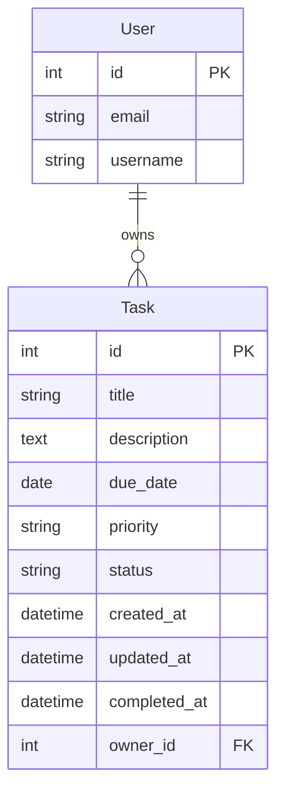

# Phase 1: Data Model - Task CRUD Operations

**Date**: 2026-01-19  
**Feature**: 002-task-crud  
**Branch**: `002-task-crud`

## Overview

This document defines the Task model schema for personal task management. The data model supports task creation, filtering, sorting, and strict ownership enforcement.

---

## Task Model

**Purpose**: Represents a user's personal task with metadata and lifecycle tracking.

**Django Model**: `tasks.models.Task`

**Schema**:
```python
from django.db import models
from django.conf import settings
from django.utils import timezone
from .validators import validate_title_length, validate_description_length

class Task(models.Model):
    PRIORITY_CHOICES = [
        ('alta', 'Alta'),
        ('media', 'Media'),
        ('baja', 'Baja'),
    ]
    
    STATUS_CHOICES = [
        ('pendiente', 'Pendiente'),
        ('completada', 'Completada'),
    ]
    
    # Required fields
    title = models.CharField(
        max_length=200,
        validators=[validate_title_length],
        help_text="Task title (max 200 chars)"
    )
    owner = models.ForeignKey(
        settings.AUTH_USER_MODEL,
        on_delete=models.CASCADE,
        related_name='tasks',
        help_text="Task owner (immutable)"
    )
    
    # Optional fields
    description = models.TextField(
        max_length=2000,
        blank=True,
        validators=[validate_description_length],
        help_text="Task description (max 2000 chars)"
    )
    due_date = models.DateField(
        null=True,
        blank=True,
        help_text="Task due date (optional)"
    )
    priority = models.CharField(
        max_length=10,
        choices=PRIORITY_CHOICES,
        default='media',
        db_index=True
    )
    status = models.CharField(
        max_length=15,
        choices=STATUS_CHOICES,
        default='pendiente',
        db_index=True
    )
    
    # Timestamps
    created_at = models.DateTimeField(
        auto_now_add=True,
        db_index=True
    )
    updated_at = models.DateTimeField(auto_now=True)
    completed_at = models.DateTimeField(
        null=True,
        blank=True,
        help_text="Timestamp when task was completed"
    )
    
    class Meta:
        db_table = 'tasks_task'
        ordering = ['-created_at']  # Newest first
        indexes = [
            models.Index(fields=['owner', '-created_at']),
            models.Index(fields=['owner', 'status']),
            models.Index(fields=['owner', 'priority']),
            models.Index(fields=['owner', 'due_date']),
        ]
    
    def save(self, *args, **kwargs):
        """Auto-update completed_at timestamp"""
        if self.status == 'completada' and not self.completed_at:
            self.completed_at = timezone.now()
        elif self.status == 'pendiente':
            self.completed_at = None
        super().save(*args, **kwargs)
    
    def __str__(self):
        return f"{self.title} ({self.get_status_display()})"
```

**Database Columns** (PostgreSQL):
- `id` (INTEGER PRIMARY KEY, auto-increment)
- `title` (VARCHAR(200), NOT NULL)
- `description` (TEXT, nullable)
- `due_date` (DATE, nullable)
- `priority` (VARCHAR(10), default 'media', INDEX)
- `status` (VARCHAR(15), default 'pendiente', INDEX)
- `created_at` (TIMESTAMP WITH TIME ZONE, INDEX)
- `updated_at` (TIMESTAMP WITH TIME ZONE)
- `completed_at` (TIMESTAMP WITH TIME ZONE, nullable)
- `owner_id` (INTEGER, FOREIGN KEY to accounts_user, CASCADE)

**Indexes**:
- Primary key on `id`
- Index on `owner_id, created_at` (for default list view)
- Index on `owner_id, status` (for status filtering)
- Index on `owner_id, priority` (for priority filtering)
- Index on `owner_id, due_date` (for due date sorting)

**Constraints**:
- `title` cannot be empty after trimming whitespace
- `owner` is immutable (cannot change after creation)
- `completed_at` auto-set when status changes to 'completada'
- `completed_at` auto-cleared when status changes to 'pendiente'

**Example**:
```python
task = Task.objects.create(
    title='Complete project proposal',
    description='Write 5-page proposal for Q2 project',
    due_date=date(2026, 2, 1),
    priority='alta',
    owner=request.user
)
```

---

## TaskQuerySet (Custom Manager)

**Purpose**: Encapsulate common query patterns for filtering and sorting.

**Django Manager**: `tasks.managers.TaskQuerySet`

```python
from django.db import models

class TaskQuerySet(models.QuerySet):
    def for_user(self, user):
        """Return tasks owned by user"""
        return self.filter(owner=user)
    
    def pending(self):
        """Return pending tasks"""
        return self.filter(status='pendiente')
    
    def completed(self):
        """Return completed tasks"""
        return self.filter(status='completada')
    
    def high_priority(self):
        """Return high priority tasks"""
        return self.filter(priority='alta')
    
    def by_due_date(self):
        """Sort by due date (nulls last)"""
        return self.order_by(models.F('due_date').asc(nulls_last=True))
    
    def by_priority(self):
        """Sort by priority (alta, media, baja)"""
        priority_order = models.Case(
            models.When(priority='alta', then=1),
            models.When(priority='media', then=2),
            models.When(priority='baja', then=3),
        )
        return self.order_by(priority_order)

class TaskManager(models.Manager):
    def get_queryset(self):
        return TaskQuerySet(self.model, using=self._db)
    
    def for_user(self, user):
        return self.get_queryset().for_user(user)

# tasks/models.py
class Task(models.Model):
    # ... fields ...
    objects = TaskManager()
```

---

## Entity Relationships



---

## Validation Rules

```python
# tasks/validators.py
from django.core.exceptions import ValidationError

def validate_title_length(value):
    """Validate title is not empty and within length"""
    if not value or len(value.strip()) == 0:
        raise ValidationError("Title cannot be empty", code='empty_title')
    if len(value) > 200:
        raise ValidationError("Title cannot exceed 200 characters", code='title_too_long')

def validate_description_length(value):
    """Validate description length"""
    if value and len(value) > 2000:
        raise ValidationError("Description cannot exceed 2000 characters", code='description_too_long')
```

---

## Migration File

```python
# Generated by Django 5.0 on 2026-01-19

from django.conf import settings
from django.db import migrations, models
import django.db.models.deletion

class Migration(migrations.Migration):
    initial = True
    dependencies = [
        ('accounts', '0001_initial'),  # Requires User model
    ]
    
    operations = [
        migrations.CreateModel(
            name='Task',
            fields=[
                ('id', models.BigAutoField(primary_key=True)),
                ('title', models.CharField(max_length=200)),
                ('description', models.TextField(max_length=2000, blank=True)),
                ('due_date', models.DateField(null=True, blank=True)),
                ('priority', models.CharField(max_length=10, choices=[('alta', 'Alta'), ('media', 'Media'), ('baja', 'Baja')], default='media', db_index=True)),
                ('status', models.CharField(max_length=15, choices=[('pendiente', 'Pendiente'), ('completada', 'Completada')], default='pendiente', db_index=True)),
                ('created_at', models.DateTimeField(auto_now_add=True, db_index=True)),
                ('updated_at', models.DateTimeField(auto_now=True)),
                ('completed_at', models.DateTimeField(null=True, blank=True)),
                ('owner', models.ForeignKey(on_delete=django.db.models.deletion.CASCADE, related_name='tasks', to=settings.AUTH_USER_MODEL)),
            ],
            options={
                'db_table': 'tasks_task',
                'ordering': ['-created_at'],
            },
        ),
        migrations.AddIndex(
            model_name='task',
            index=models.Index(fields=['owner', '-created_at'], name='tasks_task_owner_created_idx'),
        ),
        migrations.AddIndex(
            model_name='task',
            index=models.Index(fields=['owner', 'status'], name='tasks_task_owner_status_idx'),
        ),
    ]
```

---

## References

- [Django Models](https://docs.djangoproject.com/en/5.0/topics/db/models/)
- [Django QuerySets](https://docs.djangoproject.com/en/5.0/ref/models/querysets/)
- [Django Migrations](https://docs.djangoproject.com/en/5.0/topics/migrations/)
