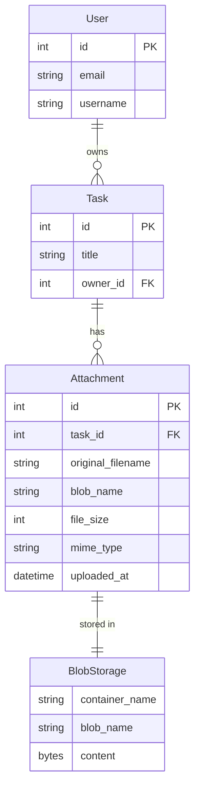

# Phase 1: Data Model - Task File Attachments

**Date**: 2026-01-19  
**Feature**: 003-task-attachments  
**Branch**: `003-task-attachments`

## Overview

This document defines the Attachment model schema for file uploads to tasks using Azure Blob Storage. The data model supports file upload, validation, secure downloads, and cascade deletion.

---

## Attachment Model

**Purpose**: Represents a file attached to a task, stored in Azure Blob Storage.

**Django Model**: `attachments.models.Attachment`

**Schema**:
```python
from django.db import models
from django.core.validators import FileExtensionValidator
from tasks.models import Task
from .validators import validate_file_size, validate_mime_type
from .storage import AzureBlobStorage

class Attachment(models.Model):
    # Foreign key to task (cascade delete)
    task = models.ForeignKey(
        Task,
        on_delete=models.CASCADE,
        related_name='attachments',
        help_text="Task this file is attached to"
    )
    
    # File metadata
    original_filename = models.CharField(
        max_length=255,
        help_text="Original filename provided by user"
    )
    blob_name = models.CharField(
        max_length=500,
        unique=True,
        db_index=True,
        help_text="Unique blob name in Azure Storage (task_id/timestamp_uuid_filename)"
    )
    file_size = models.PositiveIntegerField(
        help_text="File size in bytes"
    )
    mime_type = models.CharField(
        max_length=100,
        help_text="MIME type detected from file content"
    )
    
    # Timestamps
    uploaded_at = models.DateTimeField(
        auto_now_add=True,
        db_index=True,
        help_text="When file was uploaded"
    )
    
    class Meta:
        db_table = 'attachments_attachment'
        ordering = ['-uploaded_at']
        indexes = [
            models.Index(fields=['task', '-uploaded_at']),
        ]
        constraints = [
            models.CheckConstraint(
                check=models.Q(file_size__lte=10485760),  # 10MB
                name='file_size_limit'
            )
        ]
    
    def save(self, *args, **kwargs):
        # Validate max attachments per task before save
        if not self.pk:  # New attachment
            existing_count = Attachment.objects.filter(task=self.task).count()
            if existing_count >= 5:
                from django.core.exceptions import ValidationError
                raise ValidationError("Maximum 5 attachments per task")
        super().save(*args, **kwargs)
    
    def delete(self, *args, **kwargs):
        # Delete blob from Azure Storage before deleting record
        storage = AzureBlobStorage()
        try:
            storage.delete(self.blob_name)
        except Exception as e:
            import logging
            logging.error(f"Failed to delete blob {self.blob_name}: {e}")
            # Continue with record deletion even if blob delete fails
        super().delete(*args, **kwargs)
    
    def get_download_url(self):
        """Generate signed URL for secure download (1-hour expiration)"""
        storage = AzureBlobStorage()
        return storage.url(self.blob_name)
    
    def __str__(self):
        return f"{self.original_filename} ({self.file_size} bytes)"
```

**Database Columns** (PostgreSQL):
- `id` (INTEGER PRIMARY KEY, auto-increment)
- `task_id` (INTEGER, FOREIGN KEY to tasks_task, CASCADE)
- `original_filename` (VARCHAR(255), NOT NULL)
- `blob_name` (VARCHAR(500), UNIQUE, INDEX)
- `file_size` (INTEGER, NOT NULL, CHECK <= 10485760)
- `mime_type` (VARCHAR(100), NOT NULL)
- `uploaded_at` (TIMESTAMP WITH TIME ZONE, INDEX)

**Indexes**:
- Primary key on `id`
- Unique index on `blob_name`
- Index on `task_id, uploaded_at` (for task detail attachment list)

**Constraints**:
- `file_size` cannot exceed 10MB (10485760 bytes)
- Maximum 5 attachments per task (enforced in save method)
- `blob_name` must be unique globally

**Example**:
```python
attachment = Attachment.objects.create(
    task=task,
    original_filename='proposal.pdf',
    blob_name='42/20260119103045_a3f7b2c1_proposal.pdf',
    file_size=2048576,  # 2MB
    mime_type='application/pdf'
)
```

---

## Validators Module

**Purpose**: Custom validators for file upload validation.

**Django Module**: `attachments.validators`

```python
from django.core.exceptions import ValidationError
import magic

# File size validator
def validate_file_size(file):
    """Validate file size does not exceed 10MB"""
    max_size = 10 * 1024 * 1024  # 10MB
    if file.size > max_size:
        raise ValidationError(
            f"File size exceeds 10MB limit. File size: {file.size / 1024 / 1024:.2f}MB",
            code='file_too_large'
        )
    if file.size == 0:
        raise ValidationError(
            "Cannot upload empty file (0 bytes)",
            code='empty_file'
        )

# MIME type validator
def validate_mime_type(file):
    """Validate file MIME type by content inspection"""
    ALLOWED_MIME_TYPES = {
        'application/pdf',
        'application/msword',
        'application/vnd.openxmlformats-officedocument.wordprocessingml.document',
        'application/vnd.ms-excel',
        'application/vnd.openxmlformats-officedocument.spreadsheetml.sheet',
        'text/plain',
        'image/jpeg',
        'image/png',
    }
    
    # Read first 2048 bytes for magic number detection
    file.seek(0)
    file_header = file.read(2048)
    file.seek(0)
    
    mime = magic.from_buffer(file_header, mime=True)
    
    if mime not in ALLOWED_MIME_TYPES:
        raise ValidationError(
            f"File type '{mime}' not allowed. Allowed types: PDF, DOC, DOCX, XLS, XLSX, TXT, JPG, PNG",
            code='invalid_mime_type'
        )
    
    return mime  # Return detected MIME type for storage

# File extension validator
def validate_file_extension(filename):
    """Validate file has allowed extension"""
    import os
    ALLOWED_EXTENSIONS = {'.pdf', '.doc', '.docx', '.xls', '.xlsx', '.txt', '.jpg', '.png'}
    
    _, ext = os.path.splitext(filename.lower())
    if ext not in ALLOWED_EXTENSIONS:
        raise ValidationError(
            f"File extension '{ext}' not allowed. Allowed: {', '.join(ALLOWED_EXTENSIONS)}",
            code='invalid_extension'
        )
```

---

## Storage Backend

**Purpose**: Custom Django storage backend for Azure Blob Storage.

**Django Module**: `attachments.storage`

```python
from django.core.files.storage import Storage
from django.conf import settings
from azure.storage.blob import BlobServiceClient, generate_blob_sas, BlobSasPermissions
from datetime import datetime, timedelta
import uuid
import os
from django.utils.text import slugify

class AzureBlobStorage(Storage):
    def __init__(self):
        self.connection_string = settings.AZURE_STORAGE_CONNECTION_STRING
        self.container_name = settings.AZURE_STORAGE_CONTAINER_NAME
        self.account_name = settings.AZURE_STORAGE_ACCOUNT_NAME
        self.account_key = settings.AZURE_STORAGE_ACCOUNT_KEY
        self.client = BlobServiceClient.from_connection_string(self.connection_string)
    
    def generate_blob_name(self, task_id, original_filename):
        """Generate unique blob name: task_id/timestamp_uuid_sanitized_filename"""
        timestamp = datetime.utcnow().strftime('%Y%m%d%H%M%S')
        unique_id = uuid.uuid4().hex[:8]
        
        # Sanitize filename
        name, ext = os.path.splitext(original_filename)
        safe_name = slugify(name)[:50]  # Limit to 50 chars
        safe_filename = f"{safe_name}{ext.lower()}"
        
        return f"{task_id}/{timestamp}_{unique_id}_{safe_filename}"
    
    def _save(self, name, content):
        """Upload file to Azure Blob Storage"""
        blob_client = self.client.get_blob_client(
            container=self.container_name,
            blob=name
        )
        blob_client.upload_blob(content, overwrite=False)
        return name
    
    def _open(self, name, mode='rb'):
        """Download file from Azure Blob Storage"""
        blob_client = self.client.get_blob_client(
            container=self.container_name,
            blob=name
        )
        return blob_client.download_blob()
    
    def delete(self, name):
        """Delete blob from Azure Blob Storage"""
        blob_client = self.client.get_blob_client(
            container=self.container_name,
            blob=name
        )
        blob_client.delete_blob()
    
    def exists(self, name):
        """Check if blob exists"""
        blob_client = self.client.get_blob_client(
            container=self.container_name,
            blob=name
        )
        return blob_client.exists()
    
    def url(self, name):
        """Generate signed URL with 1-hour expiration"""
        sas_token = generate_blob_sas(
            account_name=self.account_name,
            container_name=self.container_name,
            blob_name=name,
            account_key=self.account_key,
            permission=BlobSasPermissions(read=True),
            expiry=datetime.utcnow() + timedelta(hours=1)
        )
        
        blob_url = f"https://{self.account_name}.blob.core.windows.net/{self.container_name}/{name}"
        return f"{blob_url}?{sas_token}"
```

---

## Signals Handler

**Purpose**: Cascade delete attachments when task is deleted.

**Django Module**: `attachments.signals`

```python
from django.db.models.signals import post_delete
from django.dispatch import receiver
from tasks.models import Task
from .storage import AzureBlobStorage
import logging

logger = logging.getLogger(__name__)

@receiver(post_delete, sender=Task)
def delete_task_attachments(sender, instance, **kwargs):
    """Delete all blob files when task is deleted"""
    storage = AzureBlobStorage()
    container_client = storage.client.get_container_client(storage.container_name)
    
    try:
        # List all blobs with prefix "task_id/"
        blob_list = container_client.list_blobs(name_starts_with=f"{instance.id}/")
        
        for blob in blob_list:
            try:
                container_client.delete_blob(blob.name)
                logger.info(f"Deleted blob {blob.name} for task {instance.id}")
            except Exception as e:
                logger.error(f"Failed to delete blob {blob.name}: {e}")
    except Exception as e:
        logger.error(f"Failed to list blobs for task {instance.id}: {e}")
    
    # Django ORM cascade handles Attachment records automatically
```

---

## Entity Relationships



---

## Migration File

```python
# Generated by Django 5.0 on 2026-01-19

from django.db import migrations, models
import django.db.models.deletion
import attachments.validators

class Migration(migrations.Migration):
    initial = True
    dependencies = [
        ('tasks', '0001_initial'),  # Requires Task model
    ]
    
    operations = [
        migrations.CreateModel(
            name='Attachment',
            fields=[
                ('id', models.BigAutoField(primary_key=True)),
                ('original_filename', models.CharField(max_length=255)),
                ('blob_name', models.CharField(max_length=500, unique=True, db_index=True)),
                ('file_size', models.PositiveIntegerField()),
                ('mime_type', models.CharField(max_length=100)),
                ('uploaded_at', models.DateTimeField(auto_now_add=True, db_index=True)),
                ('task', models.ForeignKey(
                    on_delete=django.db.models.deletion.CASCADE,
                    related_name='attachments',
                    to='tasks.task'
                )),
            ],
            options={
                'db_table': 'attachments_attachment',
                'ordering': ['-uploaded_at'],
            },
        ),
        migrations.AddIndex(
            model_name='attachment',
            index=models.Index(fields=['task', '-uploaded_at'], name='attachments_task_upload_idx'),
        ),
        migrations.AddConstraint(
            model_name='attachment',
            constraint=models.CheckConstraint(
                check=models.Q(file_size__lte=10485760),
                name='file_size_limit'
            ),
        ),
    ]
```

---

## References

- [Django Models](https://docs.djangoproject.com/en/5.0/topics/db/models/)
- [Django Signals](https://docs.djangoproject.com/en/5.0/topics/signals/)
- [Azure Blob Storage](https://learn.microsoft.com/en-us/python/api/overview/azure/storage-blob-readme)
