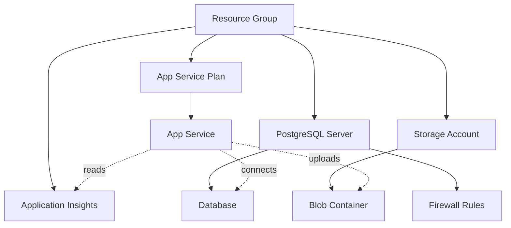

# Phase 1: Data Model - Azure Infrastructure as Code

**Date**: 2026-01-19  
**Feature**: 004-azure-infrastructure  
**Branch**: `004-azure-infrastructure`

## Overview

This document defines the Terraform resource schemas and data structures for Azure infrastructure provisioning. Unlike application data models (databases, APIs), this data model describes **infrastructure resources** as Terraform configuration blocks.

---

## 1. Resource Group

**Purpose**: Logical container for all Azure resources in an environment.

**Terraform Resource**: `azurerm_resource_group`

**Schema**:
```hcl
resource "azurerm_resource_group" "main" {
  name     = string   # Required: rg-<env>-taskmanager-<region>
  location = string   # Required: Azure region (e.g., "East US")
  tags     = map      # Required: project, environment, owner, managed_by
}
```

**Constraints**:
- Name must be globally unique within subscription
- Location determines data residency for all child resources
- Tags inherited by child resources (via module design)

**Example**:
```hcl
name     = "rg-dev-taskmanager-eastus"
location = "East US"
tags = {
  project     = "TaskManager"
  environment = "dev"
  owner       = "platform-team"
  managed_by  = "terraform"
}
```

---

## 2. App Service Plan

**Purpose**: Compute resource pool for App Service instances.

**Terraform Resource**: `azurerm_service_plan`

**Schema**:
```hcl
resource "azurerm_service_plan" "main" {
  name                = string         # Required: asp-<env>-taskmanager-<region>
  location            = string         # Required: Inherits from RG
  resource_group_name = string         # Required: RG reference
  os_type             = string         # Required: "Linux"
  sku_name            = string         # Required: B1, B2, S1 (env-specific)
  tags                = map            # Required: Same as RG
}
```

**SKU Mapping** (from research.md):
- `dev`: "B1" (1 core, 1.75 GB RAM)
- `staging`: "B2" (2 cores, 3.5 GB RAM)
- `prod`: "S1" (1 core, 1.75 GB RAM, auto-scale enabled)

**Constraints**:
- os_type must be "Linux" for Python runtime
- SKU cannot be downgraded after creation (requires destroy/recreate)

**Example**:
```hcl
name                = "asp-dev-taskmanager-eastus"
os_type             = "Linux"
sku_name            = "B1"
```

---

## 3. App Service (Web App)

**Purpose**: Django application hosting with Python 3.11 runtime.

**Terraform Resource**: `azurerm_linux_web_app`

**Schema**:
```hcl
resource "azurerm_linux_web_app" "main" {
  name                = string                    # Required: app-<env>-taskmanager-<region>
  location            = string                    # Required: Inherits from RG
  resource_group_name = string                    # Required: RG reference
  service_plan_id     = string                    # Required: ASP reference

  site_config {
    application_stack {
      python_version = string                     # Required: "3.11"
    }
    always_on                = bool               # Required: true for non-Free SKUs
    ftps_state               = string             # Required: "Disabled" (security)
    http2_enabled            = bool               # Required: true
    minimum_tls_version      = string             # Required: "1.2"
  }

  app_settings = map                              # Optional: Environment variables

  identity {
    type = string                                 # Required: "SystemAssigned"
  }

  https_only = bool                               # Required: true
  tags       = map                                # Required: Same as RG
}
```

**Constraints**:
- Name must be globally unique (becomes `<name>.azurewebsites.net`)
- Python version locked to 3.11 (per constitution)
- Managed identity required for Key Vault access (Security Principle)
- HTTPS-only enforced (Security Principle)

**Example**:
```hcl
name                = "app-dev-taskmanager-eastus"
python_version      = "3.11"
always_on           = true
minimum_tls_version = "1.2"
https_only          = true
```

---

## 4. PostgreSQL Flexible Server

**Purpose**: Managed database for Django ORM.

**Terraform Resource**: `azurerm_postgresql_flexible_server`

**Schema**:
```hcl
resource "azurerm_postgresql_flexible_server" "main" {
  name                   = string          # Required: psql-<env>-taskmanager-<region>
  location               = string          # Required: Inherits from RG
  resource_group_name    = string          # Required: RG reference
  
  administrator_login    = string          # Required: "psqladmin"
  administrator_password = string          # Required: Random 16-char, from Key Vault
  
  sku_name               = string          # Required: B_Standard_B1ms (dev), GP_Standard_D2s_v3 (staging/prod)
  storage_mb             = number          # Required: 32768 (32GB min)
  version                = string          # Required: "15" (latest stable)
  
  backup_retention_days  = number          # Required: 7 (dev), 30 (prod)
  geo_redundant_backup_enabled = bool      # Required: false (dev), true (prod)

  high_availability {
    mode = string                          # Optional: "ZoneRedundant" (prod only)
  }

  tags = map                               # Required: Same as RG
}
```

**Database Configuration**:
```hcl
resource "azurerm_postgresql_flexible_server_database" "main" {
  name      = string                       # Required: "taskmanager"
  server_id = string                       # Required: Server reference
  charset   = string                       # Required: "UTF8"
  collation = string                       # Required: "en_US.UTF8"
}
```

**Firewall Rule** (Allow App Service):
```hcl
resource "azurerm_postgresql_flexible_server_firewall_rule" "allow_app_service" {
  name             = string                # Required: "AllowAppService"
  server_id        = string                # Required: Server reference
  start_ip_address = string                # Required: App Service outbound IP
  end_ip_address   = string                # Required: App Service outbound IP
}
```

**Constraints**:
- Administrator password stored in Key Vault (Security Principle)
- TLS 1.2+ enforced via connection string parameter
- Public access disabled (firewall rules only)

**Example**:
```hcl
name                   = "psql-dev-taskmanager-eastus"
administrator_login    = "psqladmin"
sku_name               = "B_Standard_B1ms"
version                = "15"
backup_retention_days  = 7
```

---

## 5. Storage Account

**Purpose**: Blob storage for task file attachments.

**Terraform Resource**: `azurerm_storage_account`

**Schema**:
```hcl
resource "azurerm_storage_account" "main" {
  name                     = string       # Required: st<env>taskmgr<random> (alphanumeric, lowercase)
  location                 = string       # Required: Inherits from RG
  resource_group_name      = string       # Required: RG reference
  account_tier             = string       # Required: "Standard"
  account_replication_type = string       # Required: LRS (dev), GRS (prod)
  account_kind             = string       # Required: "StorageV2"
  
  min_tls_version          = string       # Required: "TLS1_2"
  https_traffic_only_enabled = bool       # Required: true
  public_network_access_enabled = bool    # Required: false

  blob_properties {
    versioning_enabled = bool             # Required: true (prod only)
  }

  tags = map                              # Required: Same as RG
}
```

**Blob Container**:
```hcl
resource "azurerm_storage_container" "attachments" {
  name                  = string          # Required: "task-attachments"
  storage_account_name  = string          # Required: Storage account reference
  container_access_type = string          # Required: "private"
}
```

**Constraints**:
- Name must be globally unique, 3-24 chars, lowercase alphanumeric
- Public blob access disabled (Security Principle)
- Versioning enabled for prod (audit trail)

**Example**:
```hcl
name                     = "stdevtaskmgr7a3f"
account_replication_type = "LRS"
min_tls_version          = "TLS1_2"
https_traffic_only_enabled = true
```

---

## 6. Application Insights

**Purpose**: Monitoring, logging, and telemetry for App Service.

**Terraform Resource**: `azurerm_application_insights`

**Schema**:
```hcl
resource "azurerm_application_insights" "main" {
  name                = string            # Required: appi-<env>-taskmanager-<region>
  location            = string            # Required: Inherits from RG
  resource_group_name = string            # Required: RG reference
  application_type    = string            # Required: "web"
  retention_in_days   = number            # Required: 30 (dev), 90 (prod)
  
  tags = map                              # Required: Same as RG
}
```

**Constraints**:
- application_type must be "web" for Django apps
- Instrumentation key output as Terraform sensitive output

**Example**:
```hcl
name              = "appi-dev-taskmanager-eastus"
application_type  = "web"
retention_in_days = 30
```

---

## 7. Key Vault (Optional, Future Enhancement)

**Purpose**: Secure storage for database passwords and storage keys.

**Terraform Resource**: `azurerm_key_vault`

**Schema** (deferred to future sprint):
```hcl
resource "azurerm_key_vault" "main" {
  name                       = string     # Required: kv-<env>-taskmgr-<random>
  location                   = string     # Required: Inherits from RG
  resource_group_name        = string     # Required: RG reference
  tenant_id                  = string     # Required: Azure AD tenant
  sku_name                   = string     # Required: "standard"
  purge_protection_enabled   = bool       # Required: true (prod)
  soft_delete_retention_days = number     # Required: 7

  access_policy {
    tenant_id = string
    object_id = string                    # App Service managed identity
    secret_permissions = ["Get", "List"]
  }

  tags = map
}
```

**Note**: Key Vault deferred to Phase 2 (implementation). For MVP, database password will be Terraform-generated random string stored in state file (acceptable for dev, must migrate to Key Vault for prod).

---

## Resource Dependency Graph



**Provisioning Order** (Terraform handles automatically):
1. Resource Group
2. Parallel: App Service Plan, PostgreSQL Server, Storage Account, App Insights
3. App Service (depends on ASP)
4. Database, Firewall Rules (depends on PostgreSQL Server)
5. Blob Container (depends on Storage Account)

---

## Environment Variable Schema (App Service)

**Injected via Terraform**:
```hcl
app_settings = {
  # Django Framework
  "DJANGO_SETTINGS_MODULE" = "taskmanager.settings.production"
  "ALLOWED_HOSTS"          = "<app-name>.azurewebsites.net"
  
  # Database (from PostgreSQL output)
  "DATABASE_HOST"     = azurerm_postgresql_flexible_server.main.fqdn
  "DATABASE_NAME"     = "taskmanager"
  "DATABASE_USER"     = "psqladmin"
  "DATABASE_PASSWORD" = azurerm_postgresql_flexible_server.main.administrator_password
  "DATABASE_PORT"     = "5432"
  "DATABASE_SSLMODE"  = "require"
  
  # Storage (from Storage Account output)
  "AZURE_STORAGE_ACCOUNT_NAME" = azurerm_storage_account.main.name
  "AZURE_STORAGE_ACCOUNT_KEY"  = azurerm_storage_account.main.primary_access_key
  "AZURE_STORAGE_CONTAINER"    = "task-attachments"
  
  # Monitoring (from App Insights output)
  "APPINSIGHTS_INSTRUMENTATIONKEY" = azurerm_application_insights.main.instrumentation_key
  "APPLICATIONINSIGHTS_CONNECTION_STRING" = azurerm_application_insights.main.connection_string
  
  # Application
  "ENVIRONMENT" = var.environment
  "DEBUG"       = "False"  # Always false in deployed environments
}
```

**Security Notes**:
- All sensitive values (passwords, keys) marked `sensitive = true` in Terraform outputs
- App Service reads from environment variables (12-factor app per Cloud-Native principle)
- Future enhancement: Migrate to Key Vault references via `@Microsoft.KeyVault(...)` syntax

---

## State File Schema

**Backend Configuration** (`backend.tf`):
```hcl
terraform {
  backend "azurerm" {
    resource_group_name  = "rg-terraform-state"      # Pre-existing RG
    storage_account_name = "tfstate<random>"          # Pre-existing SA
    container_name       = "terraform-state"
    key                  = "taskmanager-<env>.tfstate"
    use_azuread_auth     = true                       # RBAC instead of access keys
  }
}
```

**State Locking**: Enabled automatically via Azure Blob lease mechanism.

---

## Validation Rules

1. **Resource Names**: Must match naming convention `<prefix>-<env>-<service>-<region>`
2. **Tags**: All resources MUST have `project`, `environment`, `owner`, `managed_by` tags
3. **TLS**: Minimum TLS 1.2 for all services
4. **HTTPS**: HTTPS-only enabled for App Service and Storage
5. **Public Access**: Disabled for Database and Storage (firewall rules only)
6. **Backups**: Enabled for prod PostgreSQL (30-day retention)
7. **Versioning**: Enabled for prod Storage Account blobs

---

## References

- [azurerm_resource_group](https://registry.terraform.io/providers/hashicorp/azurerm/latest/docs/resources/resource_group)
- [azurerm_service_plan](https://registry.terraform.io/providers/hashicorp/azurerm/latest/docs/resources/service_plan)
- [azurerm_linux_web_app](https://registry.terraform.io/providers/hashicorp/azurerm/latest/docs/resources/linux_web_app)
- [azurerm_postgresql_flexible_server](https://registry.terraform.io/providers/hashicorp/azurerm/latest/docs/resources/postgresql_flexible_server)
- [azurerm_storage_account](https://registry.terraform.io/providers/hashicorp/azurerm/latest/docs/resources/storage_account)
- [azurerm_application_insights](https://registry.terraform.io/providers/hashicorp/azurerm/latest/docs/resources/application_insights)
